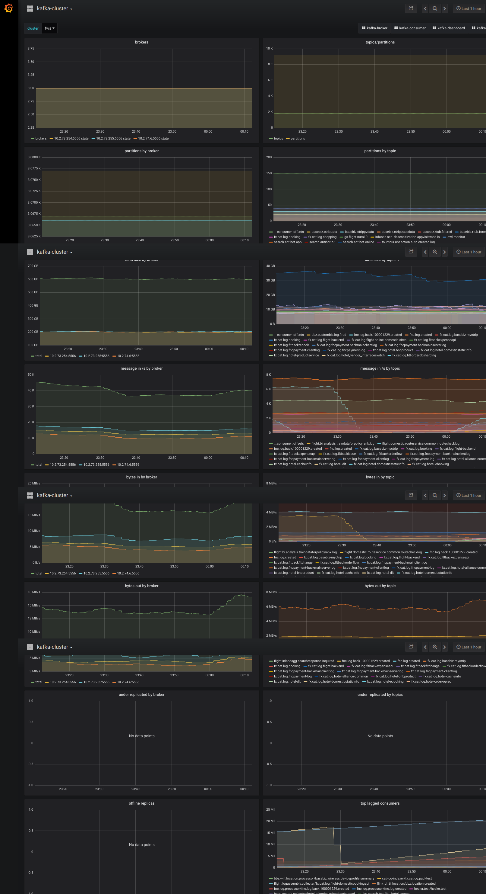
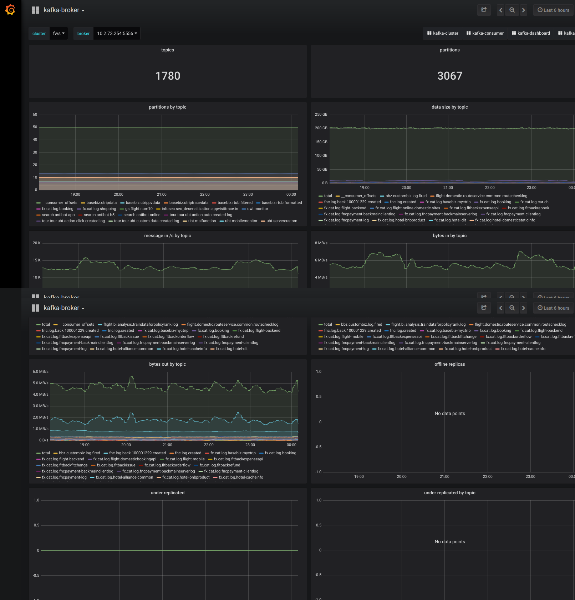
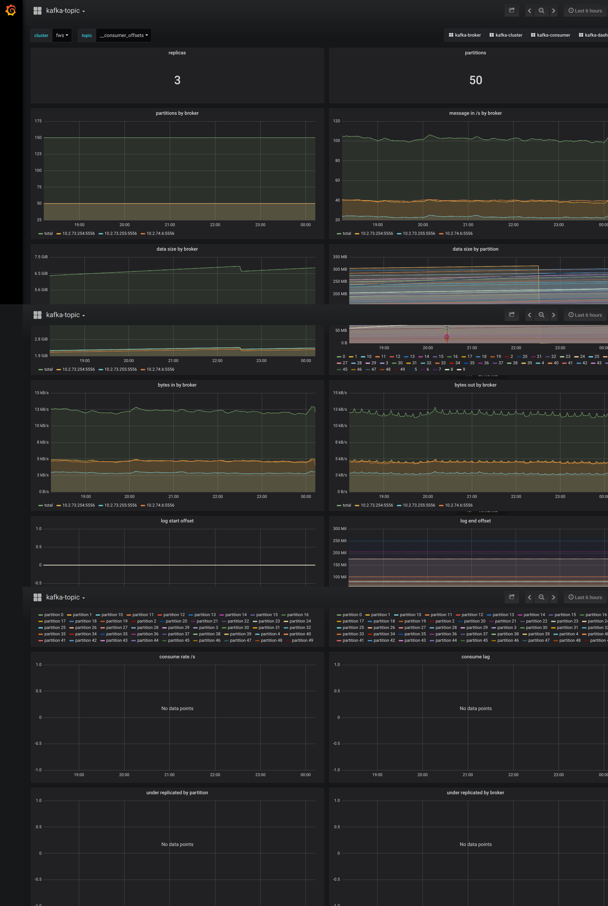
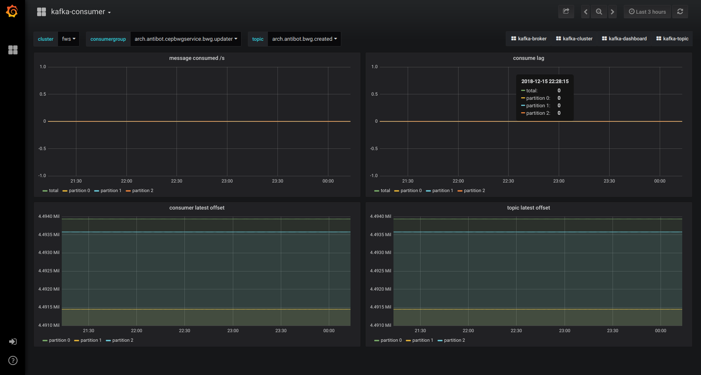
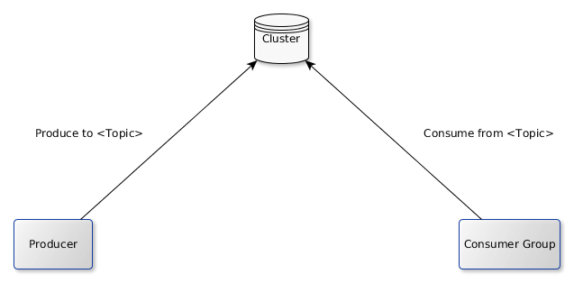
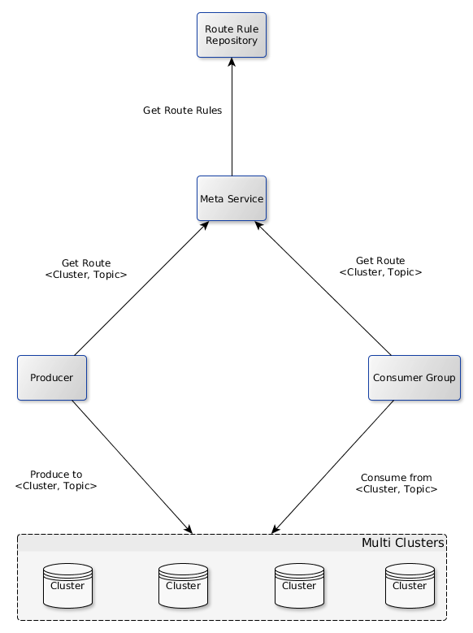
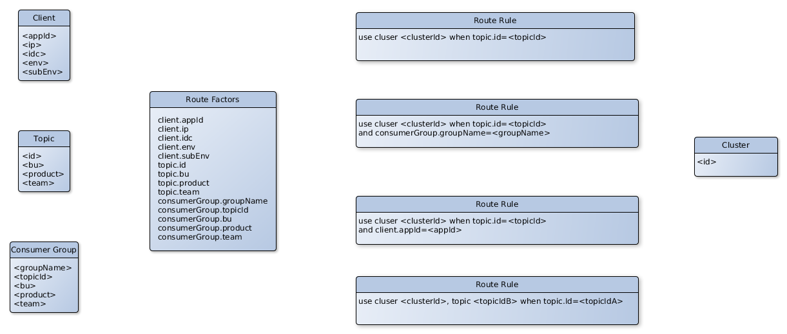
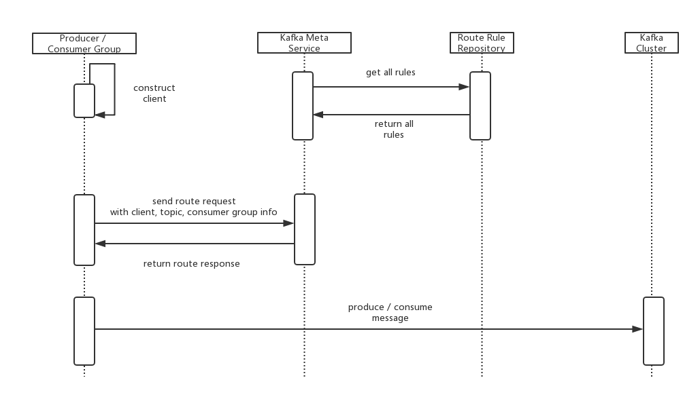
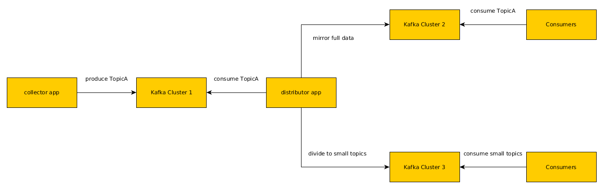
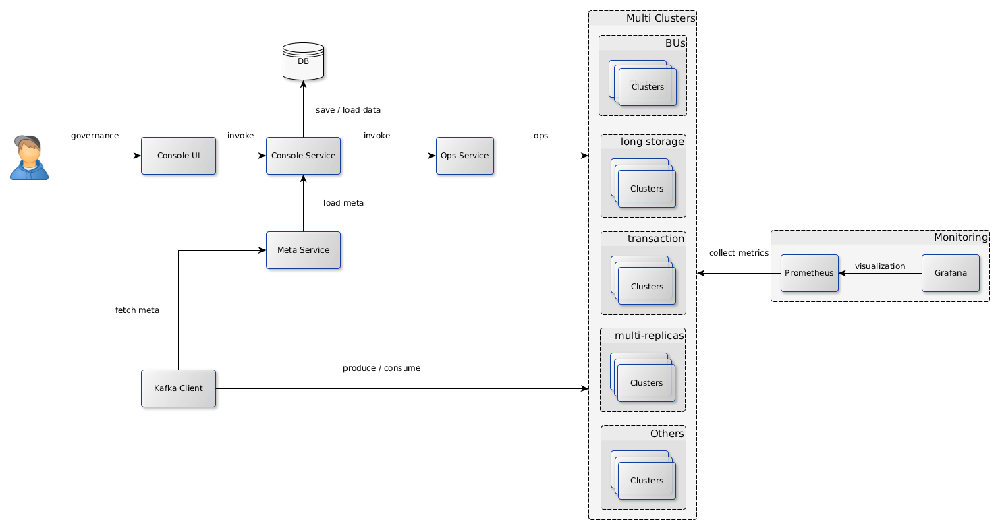

# KBear: a Kafka multi-cluster governance solution

Features

- multi-cluster
  - different topics on multiple clusters
  - 1 topic on multiple clusters
  - topic route: use annother topic instead of the one in use transparently for running producers / consumers
- monitoring: prometheus / grafana based monitoring on multiple clusters
  - cluster monitoring
  - broker monitoring
  - topic monitoring
  - consumer group monitoring

Developers

- Qiang Zhao <koqizhao@outllook.com>

目录

- [背景](#%E8%83%8C%E6%99%AF)
- [Kafka 0.9.0 => 2.0 升级之旅](#kafka-090--20-%E5%8D%87%E7%BA%A7%E4%B9%8B%E6%97%85)
  - [升级的紧迫性](#%E5%8D%87%E7%BA%A7%E7%9A%84%E7%B4%A7%E8%BF%AB%E6%80%A7)
  - [升级方案](#%E5%8D%87%E7%BA%A7%E6%96%B9%E6%A1%88)
  - [踩到的坑](#%E8%B8%A9%E5%88%B0%E7%9A%84%E5%9D%91)
  - [常见问题的解决](#%E5%B8%B8%E8%A7%81%E9%97%AE%E9%A2%98%E7%9A%84%E8%A7%A3%E5%86%B3)
- [基于 Prometheus 和 Grafana 的 Kafka 集群监控方案](#%E5%9F%BA%E4%BA%8E-prometheus-%E5%92%8C-grafana-%E7%9A%84-kafka-%E9%9B%86%E7%BE%A4%E7%9B%91%E6%8E%A7%E6%96%B9%E6%A1%88)
  - [Kafka 监控现状](#kafka-%E7%9B%91%E6%8E%A7%E7%8E%B0%E7%8A%B6)
  - [Kafka JMX Metrics](#kafka-jmx-metrics)
  - [可用的开源组件](#%E5%8F%AF%E7%94%A8%E7%9A%84%E5%BC%80%E6%BA%90%E7%BB%84%E4%BB%B6)
  - [监控方案](#%E7%9B%91%E6%8E%A7%E6%96%B9%E6%A1%88)
  - [监控截图示例](#%E7%9B%91%E6%8E%A7%E6%88%AA%E5%9B%BE%E7%A4%BA%E4%BE%8B)
- [Kafka 多集群解决方案](#kafka-%E5%A4%9A%E9%9B%86%E7%BE%A4%E8%A7%A3%E5%86%B3%E6%96%B9%E6%A1%88)
  - [为什么要多集群](#%E4%B8%BA%E4%BB%80%E4%B9%88%E8%A6%81%E5%A4%9A%E9%9B%86%E7%BE%A4)
  - [多集群架构](#%E5%A4%9A%E9%9B%86%E7%BE%A4%E6%9E%B6%E6%9E%84)
  - [多集群路由](#%E5%A4%9A%E9%9B%86%E7%BE%A4%E8%B7%AF%E7%94%B1)
  - [实际案例](#%E5%AE%9E%E9%99%85%E6%A1%88%E4%BE%8B)
- [企业级 Kafka 应用架构](#%E4%BC%81%E4%B8%9A%E7%BA%A7-kafka-%E5%BA%94%E7%94%A8%E6%9E%B6%E6%9E%84)

## 背景

早在2014年，携程的一些业务部门开始引入Kafka作为业务日志的收集处理系统。2015年，基于Kafka的高并发、大数据的特点，携程框架研发部在Kafka之上设计了Hermes Kafka消息系统，作为大规模的消息场景的统一的中间件。随着业务量的迅速增加，以及具体业务、系统运维上的一些误用，Kafka现有系统变得不稳定，经历了多次down机，故障期间完全不可用，持续时间长达5小时以上，恢复缓慢。Kafka还能用多久？成为一个迫切棘手的问题。问题严重又难以解决，必须做出改变。

笔者在携程框架研发部任职，2018年5月起负责Kafka消息系统。重点解决Kafka运维使用中的关键问题，建设Kafka消息系统应用架构体系。本文分享携程的Kafka应用实践。

## Kafka 0.9.0 => 2.0 升级之旅

### 升级的紧迫性

2016年初，携程Kafka升级到了0.9.0这一里程碑式的版本。在这个版本里，客户端去除了zookeeper依赖，大大提升了系统稳定性。自此以后，到2018年5月，Kafka经历了0.10.x，0.11.x，1.x，1.1 4个大版本。0.9.0之上的运维工具，如Kafka Manager、Kafka Offset Monitor、exhibitor等，要么停止维护，要么不再有新的功能更新。对于运维中暴露出来的问题，缺少解决方案。

- 消息发送异步变同步: producer内部使用了一个内存池，消息进来从池上分配1块内存，消息发送后回收。一旦broker负载过重，写磁盘慢，producer的内存池消耗快，回收慢，就会使客户端的异步的消息发送变成同步堵塞，严重影响用户的业务。

- broker进程crash后无法启动: 进程有时会crash。由于没有优雅关闭，一些磁盘数据会毁坏，导致无法再次启动。必须手工删除毁坏的数据才能启动。

- broker under replicated：发现broker处于under replicated状态，但不确定问题的产生原因，难以解决。（其实是broker过载，但难以排查是哪些topic导致，应迁移哪些topic的数据）

- 单副本：为缓解under replicated问题，采用了一个牺牲可靠性的办法，topic从多副本变为单副本。但又引发了新的问题，broker重启、crash，都会导致消息丢失，broker硬件故障，更会导致broker相关的topic长期无法使用。

- 缺少历史监控：Kafka Manager只提供运行时的指标，无历史指标，出问题后，难以分析事故原因。

- 监控指标不完善：如topic、partition、broker的数据size指标。

- 数据迁移困难：topic一般在多个broker上，当某个broker负载重时，需要把这个broker上的某个（某几个）topic的分区迁移到其它broker。无UI工具可用，需要到broker机器上执行脚本。费力度高，低效。也缺少把1个broker上的数据整体迁移到新的broker上的能力。

- broker负载不均衡：有的broker负载重，有的负载轻。无法自动调配。有新的工具（如cruise-control），但由于Kafka版本低，无法使用。

- 新的feature无法使用：如事务消息、幂等消息、消息时间戳、消息查询等。

### 升级方案

Kafka官网上明确说明高版本兼容低版本，可以从低版本透明升级。鉴于Kafka集群数据量大，broker数目多，升级失败后的影响大，决定从小到大，分批次灰度升级。

- 测试环境升级：2个3节点小集群，分2批次进行，持续1周，运行正常。

- 生产小集群升级：13台机器，分2批次（5台,8台）进行，持续1周，运行正常。

- 生产大集群升级：63台机器，分5批次进行（5台，8台，10台，13台，27台），持续3周，运行正常。

从调研、测试到实施完成，8月下旬到九月底，共6周时间，从0.9.0直升2.0。升级步骤完全按照官方规范进行，感谢Kafka产品的优秀的兼容性。

### 踩到的坑

共踩到2个坑，都在测试环境发现。

- kafka-server-stop.sh脚本失效问题：2.0改变了-cp的格式，从lib/*变成了/lib/xx.jar:...，由于依赖项很多，导致命令行非常长。在centos 7.3上，ps命令可以正常显示，但在centos 6.4和7.1上，会被截断，导致grep无法抓取到末尾的kafka.Kafka特征，无法定位进程。通过修改脚本解决问题。

- 单副本partition全部offline（leader为-1）)：2.0改变了配置unclean.leader.election.enable的默认值（从true变为false），多副本时，无影响。由于2.0与0.9.0的leader选举的处理机制不同，升级过程中，同时存在2.0与0.9.0的broker，对于单副本的partition，isr会被清空（leader为-1）且无法恢复。通过在server.properties里加入配置unclean.leader.election.enable=true解决。全部broker升级完成后，此项配置可以去除。这是一个严重的不兼容变更，如果在生产环境发现，会导致严重事故。

另外，官方文档里特别说明了应保持数据格式为0.9.0，不要使用2.0格式，以免数据格式转换导致broker cpu利用率过高。需在server.perperties里加入配置：log.message.format.version=0.9.0。

### 常见问题的解决

- broker进程crash后无法启动: 升级后未再遇到此问题。并且重启（stop/start）速度更快，部分负载重的机器，升级前重启一次要花10分钟左右，升级后重启一般在3分钟以内完成。

- broker under replicated：升级后可通过后文中的监控方案快速定位到流量大的topic，迁移流量大的topic数据到空闲broker，可快速降低负载。

- 单副本：由于升级后容易定位和解决under replicated问题，单副本再无必要，可恢复为正常的多副本。

- 缺少历史监控：升级后通过后文中的监控方案解决。

- 监控指标不完善：2.0有丰富的监控指标。如关键的Size指标。

- 数据迁移困难：2.0提供了Admin Client。基于Admin Client和Kafka Core，自研了ops service，能方便地进行日常的topic/partition/broker数据迁移运维。如降低机器负载（把1个broker上部分topic数据迁移到其它broker）、下线旧机器（把1个broker上的全部数据迁移到其它broker）等。

- broker负载不均衡：新的自动rebalance开源工具cruise-control（https://github.com/linkedin/cruise-control）。

- 新的feature：事务消息、幂等消息、消息时间戳、消息查询（KSQL）等。

- 消息发送异步变同步：客户端比较分散，短期难以统一升级。但可通过后文中的服务端多集群架构改善broker负载，避免此问题。

## 基于 Prometheus 和 Grafana 的 Kafka 集群监控方案

### Kafka 监控现状

0.9.0时，broker端主要使用kafka-manager作为监控工具，能看到实时的metrics，并做了一些聚合。但数据不落地，无法进行历史数据回放。同时缺少size指标，无法查看topic、partition、broker的数据量情况。其它的工具如Kafka Offset Monitor和trifecta，在数据量大时查询缓慢，基本不可用。

新的运维工具（如cruise-control、KSQL等），无法在0.9.0上使用。

### Kafka JMX Metrics

Kafka broker的内部指标都以JMX Metrics的形式暴露给外部。2.0提供了丰富的监控指标，完全满足监控需要。后文中的监控截图里有常见的监控指标，完全的指标列表可通过JConsole查看Kafka的MBeans。

### 可用的开源组件

- Prometheus：Prometheus是一个云原生的metrics时间序列数据库，具备metrics采集、查询、告警能力。笔者今年3月接触到，非常喜爱。

- Grafana： metrics可视化系统。可对接多种metrics数据源。

- JMX Exporter：把JMX metrics导出为Promethues格式。https://github.com/prometheus/jmx_exporter

- Kafka Exporter：汇聚常见的Kafka metrics，导出为Prometheus格式。https://github.com/danielqsj/kafka_exporter

### 监控方案

- JMX Exporter：部署到每台broker上。
  
- Kafka Exporter：部署到任意1台broker上。
  
- Prometheus：部署到1台独立机器上，采集JMX Exporter和Kafka Exporter上的数据。

- Grafana：部署到1台独立机器上，可视化Prometheus Kafka metrics数据。对于cluster、broker、topic、consumer 4个角色，分别制作了dashboard。

### 监控截图示例

## Kafka 多集群解决方案

### 为什么要多集群

15年，生产只搭建了1个集群，不到10个节点，但随着业务的大量接入和某些业务的不合理使用，以及驾驭能力不足（有问题加机器），生产集群扩大到63个节点。全公司业务混杂在一起，部分业务数据量极大。1个topic数据量激增，或某个broker负载过重，都会影响到多个不相干业务。甚至某些broker的故障导致整个集群，全公司业务不可用。集群节点数目过大，也导致运维、升级过程漫长，风险极大。

迫切需要从多个不同维度把大集群分拆为小集群，进行业务隔离和降低运维复杂度。

### 多集群架构

原生的单集群架构

引入1个meta service，改造为多集群架构

同时仍然提供统一的client给用户，封装多集群相关的配置（如哪个topic在哪个集群上），用户仍然以原生的单集群的方式使用。可以通过调整路由规则，动态地把topic从1个集群迁移到另一个集群，对用户透明。

### 多集群路由

单机群模式下，只需要topic便可进行消息的生产、消费。多集群模式下，需要知道1个&lt;cluster, topic&gt;二元组。客户端、topic、consuemer的元数据，构成了影响路由的因子。根据这些路由因子，可灵活制定路由规则。

寻址过程

当路由规则变化时，client可以近实时地感知到(2分钟左右），自动重启使路由规则生效。

### 实际案例

携程量最大的topic，流量峰值入口250m/s，出口8g/s。出口流量远大于入口流量，写少读多。入口流量稳定，但出口流量经常飙升（消费者增加）。出口流量飙升，导致磁盘利用率升高，反过来大幅降低写入速度，使消息生产异步变同步，严重影响业务。由于业务设计不合理，只消费部分数据的用户，必须消费全量数据，需要把原始的topic数据进行处理，分拆为专用的topic以减少无效消费。

基于多集群架构，从1个集群变为读写分离的3个集群，降低数据写入的风险，减少无效消费。2周左右实施完成。对消费者透明。

## 企业级 Kafka 应用架构

Kafka原生的集群模式使用简单，能满足少量业务的需要。但对于大型企业（网站），大量的业务使用Kafka，数据量、流量极大，必然同时存在多个集群，需要对用户的接入、运行时监控、集群运维提供统一的解决方案。下图是携程正在研发的解决方案，部分架构元素已开发完成并投产。将来会开源出来，回馈社区。

说明

- Console UI/Service：面向用户。用于topic/consumer/cluster注册、配置管理、集群运维的统一的治理系统。数据落地到DB持久存储。待开发。

- Meta Service：面向client（producer/consumer）。从console service加载元数据信息（路由规则等），供client寻址用。已投产。

- Ops Service：基于Kafka admin client和Kafka core，把运维服务化，降低运维复杂度。已开发基本功能，待投产。

- Kafka Clusters：按多个维度搭建的多个集群。可灵活搭建和运维变更。

- Monitoring （Prometheus + Grafana）：集群监控解决方案。已投产。
