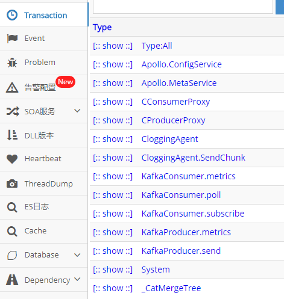
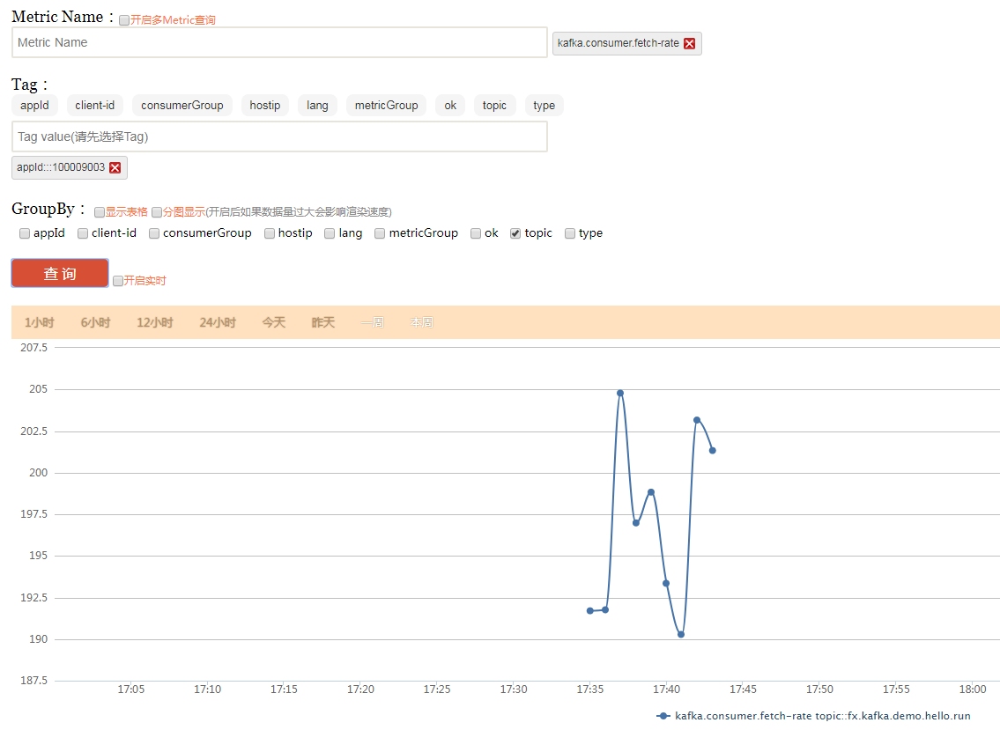

# KBear Client

目录

- [概述](#%E6%A6%82%E8%BF%B0)
- [POM 依赖](#pom-%E4%BE%9D%E8%B5%96)
- [用法](#%E7%94%A8%E6%B3%95)
  - [创建 Producer](#%E5%88%9B%E5%BB%BA-producer)
  - [创建 Consumer](#%E5%88%9B%E5%BB%BA-consumer)
  - [不支持的api](#%E4%B8%8D%E6%94%AF%E6%8C%81%E7%9A%84api)
  - [特殊场景](#%E7%89%B9%E6%AE%8A%E5%9C%BA%E6%99%AF)
- [配置](#%E9%85%8D%E7%BD%AE)
- [监控](#%E7%9B%91%E6%8E%A7)
  - [cat监控](#cat%E7%9B%91%E6%8E%A7)
  - [Metrics Dashboard监控](#metrics-dashboard%E7%9B%91%E6%8E%A7)

## 概述

kbear-client集成了KBear kafka meta service，自动对producer、consumer 进行kafka 集群寻址（即不需要用户自己配置bootstrap.servers）。同时对接了CAT、Metrics监控，把kafka运行时数据暴露到CAT、Metrics Dashboard。

Producer、Consumer 要通过CKafkaClientFactory来进行创建。创建后，用法和原生的kafka client相同。参考：http://kafka.apache.org/documentation/

注意：

- 必须在JDK 8 或以上版本Java环境运行。
- kbear-client-ctrip代码不在master分支上，在分支kbear-ctrip上。可根据自己公司实际的监控需要修改。本文仅作为示例。

## POM 依赖

```xml
    <properties>
        <java.version>1.8</java.version>
        <kafka-clients.version>2.0.1</kafka-clients.version>
        <kbear-client.version>1.0.3</kbear-client.version>
    </properties>
 
    <dependencyManagement>
        <dependencies>>
            <dependency>
                <groupId>org.apache.kafka</groupId>
                <artifactId>kafka-clients</artifactId>
                <version>${kafka-clients.version}</version>
            </dependency>
            <dependency>
                <groupId>com.ctrip.framework.kbear</groupId>
                <artifactId>kbear-client</artifactId>
                <version>${kbear-client.version}</version>
            </dependency>
            <dependency>
                <groupId>com.ctrip.framework.kbear</groupId>
                <artifactId>kbear-client-ctrip</artifactId>
                <version>${kbear-client.version}</version>
            </dependency>
        </dependencies>>
     </dependencyManagement>
  
    <dependencies>
        <dependency>
            <groupId>com.ctrip.framework.kbear</groupId>
            <artifactId>kbear-client-ctrip</artifactId>
        </dependency>
    </dependencies>
```

## 用法

### 创建 Producer

```java
Properties properties = new Properties();
properties.put("key.serializer", "org.apache.kafka.common.serialization.StringSerializer");
properties.put("value.serializer", "org.apache.kafka.common.serialization.StringSerializer");
Producer<String, String> producer = CKafkaClientFactory.getDefault().newProducer(properties);
```

### 创建 Consumer

```java
Properties properties = new Properties();
properties = new Properties();
properties.put("group.id", “<your consumer group>");
properties.put("key.deserializer", "org.apache.kafka.common.serialization.StringDeserializer");
properties.put("value.deserializer", "org.apache.kafka.common.serialization.StringDeserializer");
Consumer<String, String> consumer = CKafkaClientFactory.getDefault().newConsumer(properties);
```

### 不支持的api

| component | method | comment |
| --- | --- | --- |
| Producer | initTransactions | 事务必须在同一个集群处理 |
| Producer | beginTransaction | 事务必须在同一个集群处理 |
| Producer | sendOffsetsToTransaction | 事务必须在同一个集群处理 |
| Producer | flush | 事务必须在同一个集群处理 |
| Producer | commitTransaction | 事务必须在同一个集群处理 |
| Producer | abortTransaction | 事务必须在同一个集群处理 |
| Consumer | subscribe(Pattern pattern) | 暂不支持正则订阅 |
| Consumer | subscribe(Pattern pattern, ConsumerRebalanceListener callback) | 暂不支持正则订阅 |

### 特殊场景

如大数据场景，需要加入一些job类型，job名称信息，以便更细粒度的监控和路由管控。

```java
Client client = CKafkaClientFactory.newDefaultClient(); // 获取环境客户端信息，包含appId等
client.getMeta().put("jobType", "storm"); // 设置job类型，storm，flink等
client.getMeta().put("jobName", "<job-name>"); // 设置job名称
client.getMeta().put("jobDepartment", "<job-department>"); // 设置job所属部门，如flight、hotel等
// 创建KafkaClientFactory。KafkaClientFactory占用资源，应1个应用全局创建1个，不要反复创建，以免资源泄露，线程安全，可在并发里使用。
CKafkaClientFactory kafkaClientFactory = new CKafkaClientFactory(client);

kafkaClientFactory.newConsumer(properties); // 创建consumer，参考上文consumer创建
kafkaClientFactory.newProducer(properties); // 创建producer，参考上文producer创建
```

## 配置

Producer、Consumer配置同原生Kafka client的配置（但不需要再配置bootstrap.servers）。

参考：

http://kafka.apache.org/documentation/#producerconfigs

http://kafka.apache.org/documentation/#consumerconfigs

## 监控

### cat监控

如下图（注意以KafkaConsumer和KafkaProducer开头的transaction，命名格式为<类名>.<方法名>）：



### Metrics Dashboard监控

如下图（metric name统一以kafka.producer和kafka.consumer开头，格式为kafka.producer.<kafka-metric-name>或kafka.consumer.<kafka-metrics-name>）：


