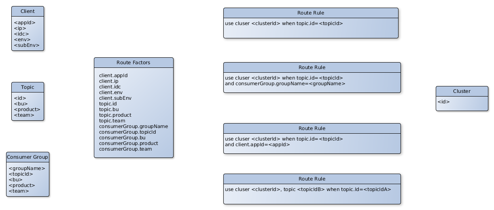

# KBear Cluster Route Rule Language (CRRL)

CRRL 是专门为Kafka多集群设计的路由规则语言。

目录

- [概念](#%E6%A6%82%E5%BF%B5)
  - [Client](#client)
  - [Topic](#topic)
  - [Consumer Group](#consumer-group)
  - [Cluster](#cluster)
  - [Route Factors](#route-factors)
  - [Route Rule](#route-rule)
  - [示例图](#%E7%A4%BA%E4%BE%8B%E5%9B%BE)
- [语法](#%E8%AF%AD%E6%B3%95)
- [规则分类](#%E8%A7%84%E5%88%99%E5%88%86%E7%B1%BB)
  - [global rule](#global-rule)
  - [topic rule](#topic-rule)
  - [consumer group rule](#consumer-group-rule)
- [规则优先级](#%E8%A7%84%E5%88%99%E4%BC%98%E5%85%88%E7%BA%A7)
- [寻址](#%E5%AF%BB%E5%9D%80)
  - [寻址分类](#%E5%AF%BB%E5%9D%80%E5%88%86%E7%B1%BB)
  - [寻址过程](#%E5%AF%BB%E5%9D%80%E8%BF%87%E7%A8%8B)
- [完整示例](#%E5%AE%8C%E6%95%B4%E7%A4%BA%E4%BE%8B)

## 概念

### Client

相对Kafka Broker而言，Kafka Producer或Consumer的宿主应用。Client由1个id进行唯一标识，并且可以有多个基于K/V的元信息。

### Topic

1个Kafka topic，由1个id（即topic name）来唯一标识。1个topic可以部署在某1个cluster上，也可部署在多个cluster上。Topic可以有多个基于K/V的元信息。

### Consumer Group

某个Topic的1个Consumer Group，由1个id（topic id和consumer group name组成的二元组）来唯一标识。唯一标识1个消费者。Consumer Group可以有多个基于K/V的元信息。

Kafka里Consumer Group由group name标识，可以同时消费多个topic。KBear里，Consumer Group细化为消费某一个确定的Topic的Group。

### Cluster

1个Kafka Cluster，由1个id（即cluster name）来唯一标识。

### Route Factors

影响路由的因子。Client、Topic、Consumer都可能影响路由。

factor keys:

- client.id
- client.&lt;metaKey&gt;
- topic.id
- topic.&lt;metaKey&gt;
- consumerGroup.groupName
- consumerGroup.topicId
- consumerGroup.&lt;metaKey&gt;

### Route Rule

路由规则。根据路由因子，决定使用哪个集群。

### 示例图



## 语法

```crrl
use cluster <cluster.id>
```

如：

```crrl
use cluster fws
```

或

```crrl
use cluster <cluster.id> when <factor.key>=<factor.value> [and <factor.key>=<factor.value> ...]
```

```crrl
use cluster uat when client.env=uat
```

## 规则分类

rule根据用途，分为3类：全局规则、topic特定的规则、consumer group特定的规则。以yaml配置为举例说明。

### global rule

参与到所有路由寻址过程的规则。

如：

```yaml
route-rules:
   - id: r100001
     meta:
       rule.isGlobal: true
     rule: use cluster fws
```

### topic rule

只对某个topic有效的规则。

```yaml
route-rules:
   - id: r100002
     meta:
       topic.id: fx.kafka.demo.hello.run
     rule: use cluster uat
```

### consumer group rule

只对某个consumer group有效的规则。

```yaml
route-rules:
   - id: r100003
     meta:
       consumerGroup.groupName: fx.kafka.demo.hello.run.consumer
       consumerGroup.topicId: fx.kafka.demo.hello.run
     rule: use cluster prod
```

## 规则优先级

规则优先级是规则的1个整型属性。值越大，表明优先级越高，值越小，优先级越低。

默认为0，可不配置。

如：

```yaml
   - id: r100005
     priority: 0
     meta:
        consumerGroup.groupName: fx.hellobom.string.consumer
        consumerGroup.topicId: fx.kafka.demo.hello.run
     rule: use cluster fws
   - id: r100006
     priority: 1
     meta:
       rule.isGlobal: true
     rule: use cluster uat when client.env=UAT
```

如果相同优先级的规则有多条:

- consumer group特定的规则优先
- 其次为topic特定的规则优先
- 最后为全局规则

如：

```yaml
route-rules:
   - id: r100001
     meta:
       rule.isGlobal: true
     rule: use cluster fws
   - id: r100002
     meta:
        topic.id: fx.kafka.demo.hello.run
     rule: use cluster uat
   - id: r100004
     meta:
        consumerGroup.groupName: fx.kafka.demo.hello.run.consumer
        consumerGroup.topicId: fx.kafka.demo.hello.run
     rule: use cluster prod
```

priority都为0，优先级按类型排序：r100004 > r100002 > r100001

相同优先级，相同类型的多条规则，优先级未定义，随机排序。

## 寻址

### 寻址分类

按Producer和Consumer，分为2类。

Producer寻址和2类规则相关：

- topic特定的路由规则
- 全局路由规则

Consumer寻址和3类规则相关：

- consumer group特定的路由规则
- topic特定的路由规则
- 全局路由规则

### 寻址过程

把相关的路由规则汇总，按优先级从大到小排成一条链。从链首规则开始，如果当前规则能找到cluster，返回该cluster，路由结束。否则由下一个规则继续寻址。如果整条链都寻址完毕，仍然不能找到cluster，说明无cluster可用。

## 完整示例

Client信息由用户在寻址时提供，Topic、ConsumerGroup、Cluster、RouteRule可在yaml文件里配置。

[配置示例](../java/meta-service/src/test/resources)

- clusters.yaml
- topics.yaml
- consumer-groups.yaml
- route-rules.yaml
